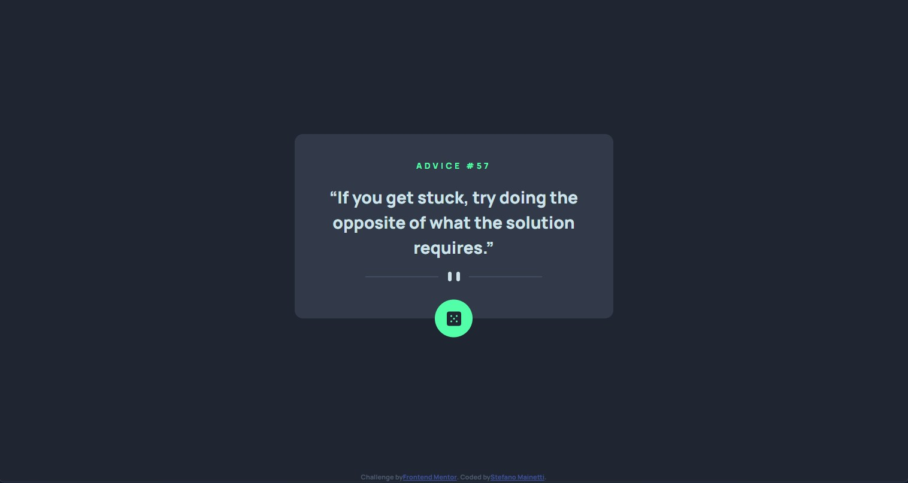

# Frontend Mentor - Advice generator app solution

This is a solution to the [Advice generator app challenge on Frontend Mentor](https://www.frontendmentor.io/challenges/advice-generator-app-QdUG-13db). Frontend Mentor challenges help you improve your coding skills by building realistic projects.

## Table of contents

- [Overview](#overview)
  - [The challenge](#the-challenge)
  - [Screenshot](#screenshot)
  - [Links](#links)
- [My process](#my-process)
  - [Built with](#built-with)
  - [What I learned](#what-i-learned)
  - [Continued development](#continued-development)
- [Author](#author)

## Overview

### The challenge

Users should be able to:

-

### Screenshot

### Links

- Solution URL: [https://github.com/stefanomainetti/advice-generator](https://github.com/stefanomainetti/advice-generator)
- Live Site URL: [https://stefanomainetti.github.io/advice-generator/](https://stefanomainetti.github.io/advice-generator/)

## My process

### Built with

- Semantic HTML5 markup
- SASS
- Mobile-first workflow
- Javascript
- Browserify/Esmify
- Minify

### What I learned

By facing this challenge I have realized the need for bundling JS modules to make "import" working.

### Continued development

Still facing issues with assets url in SCSS vs bundled CSS. Need to practice to get more confidence.

## Author

- Frontend Mentor - [@stefanomainetti](https://www.frontendmentor.io/profile/stefanomainetti)
